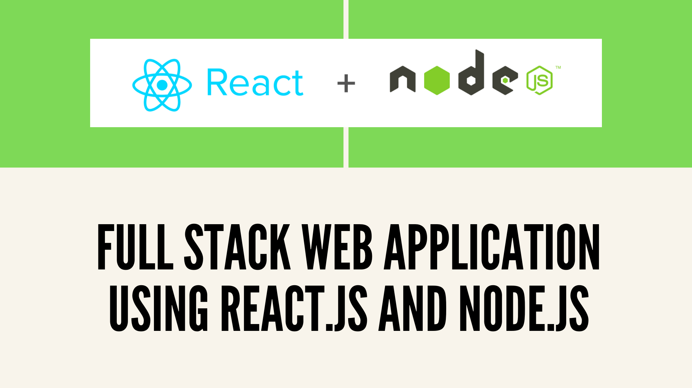

# SCRABBLE

<h1></h1>

### Usage

1. Install docker desktop
..... [Mac](https://docs.docker.com/docker-for-mac/install/)
   ..... [Windows](https://docs.docker.com/docker-for-windows/install/)
2. Start Docker from applications
3. Navigate to root of the project in terminal
4. Run following command
```Bash
docker-compose up -d
# or "docker-compose up --build -d"
# if you want to rebuild the containers
```
5. It takes few seconds to build images when its ran first time.
6. After it successfully builds both client and server images. Go to browser and hit localhost,
7. You should see React pages and can use the interface to hit server
8. You can also use localhost:8080 to hit server directly

### Without Docker
1. Please navigate to server folder, and read the instruction in README.md


## Tech Stack

<h1></h1>

| Web Development       | Technologies     |
| ------------- | ---------- |
|  Frontend | React, Redux, Thunk, CSS   |
| Backend   | ES6, Javascript, Express, NodeJS |
| Server  | NGINX|
| Containers   | Docker, Docker Compose |
| Data structures   | Trie, Map Objects |
| Test tools   | Jest, Mocha, Chai, Sinon |
| Automation  tools   | NPM, Gulp |


### Trie Data Structure

A trie is a tree like data structure which stores strings, and helps you find the data associated with that string using the prefix of the string.

Trie is very good for lookups, as it depends only on number of characters in the input and not on number of words in dictionary

#### Performance Analysis

###### Time Complexity

1. Program is designed efficiently where we initialize trie only once and re-use it for every request
2. So time complexity of the program is Creation + Finding Words
3. The worst case for creating trie from given words depends on number of words and average length of words
Which is `O(l*n)` where l is average length of words and n is number of words
4. Finding words formed by given letters in trie depends on length of the input letters and number of possible words.
5. Even negative lookup, which is string formed by letters is not a word, can be do in atmost length of input characters

###### Space Complexity

1. As for space complexity, trie is implemented to have resizable nodes
2. Within a trie, words with same prefix share the memory area, but in worst case, if no strings share same prefix (which is less possible in scrabble case), trie can take lot of memory O(M) where M is size of all nodes


