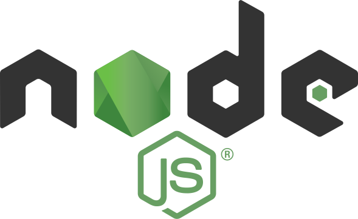

# Scrabble Server

### Dockerized Express, NodeJs Application.

<p>
  
  
  
</p>

#### Prerequisites

- Docker
- or NodeJS > 12.0

> Installing any one of them can run the project, Docker is preferred :)

#### Through Docker

1. Install Docker Desktop
   ..... [Mac](https://docs.docker.com/docker-for-mac/install/)
   ..... [Windows](https://docs.docker.com/docker-for-windows/install/)

2. Start Docker from applications
3. Navigate to server folder of the project, and run below commands in terminal sequentially

```Bash
docker build . --tag scrabble-server-image:1.0 .
```

. is important in above command.
docker build creates an image of project environment where it was created

```Bash
docker run -p 8080:8080 -d scrabble-server-image:1.0
```

docker run will run that project-environment/container

4. Open browser and hit `localhost:8080`
5. If everything went well, you should see ` {message: Connected!}` and its ready for testing

#### Through NodeJS

1. [Install NodeJS](https://nodejs.org/en/download/) 12 or above
2. Tets `node -v` in terminal to see if its properly installed
3. Navigate to sever folder of the project and run following commands in terminal

```Bash
npm install
```

```Bash
npm start
```

4. Open browser and hit `localhost:8080`
5. If everything went well, you should see ` {message: Connected!}` and its ready for testing
